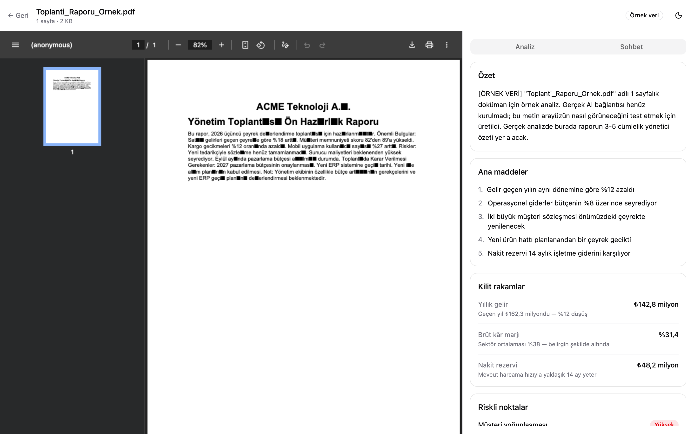

# Doküman Analiz — Uzun raporlar için toplantı hazırlığı

Türkçe · **[English](./README.md)**

Elinde 60 sayfalık bir çeyrek raporu var ve 10 dakika sonra toplantı. Bu araç
raporu okuyup sana bir brifing veriyor: ne diyor, nesi riskli, ne sorman lazım.



---

## "Bir PDF sohbet uygulaması daha" değil

Çoğu PDF aracı senin doğru soruyu bilmeni bekler. Bu araç **ne sorman
gerektiğini söylüyor** — çünkü toplantıya giren kişi genelde bunu bilmez.

| Genel PDF sohbeti | Bu |
| --- | --- |
| Doğru soruyu bilmen gerekir | Sorulmaya değer soruları üretir |
| Nötr özet | **Riskleri** seviyesiyle birlikte açıkça çıkarır |
| Sadece soru-cevap | Önce brifing, sonra sohbet |

Yükledikten hemen sonra: özet, ana maddeler, önemli rakamlar, işaretlenmiş
riskler ve toplantıda sorulabilecek keskin sorular. Sohbet, derine inmek
istediğinde orada.

---

## Özellikler

- **Yükleme** — tıklayarak veya sürükle-bırak (32 MB / 600 sayfa, sunucuda doğrulanır)
- **Otomatik brifing** — özet, ana maddeler, kilit rakamlar, seviyeli riskler, önerilen sorular
- **Sohbet** — cevaplar kelime kelime akar
- **Taranmış PDF tespiti** — dosya metin değil fotoğrafsa uyarır
- **Arka planda analiz** — yükleme ~1 saniyede döner, sonuç hazır olunca belirir
- **Açık / karanlık tema** — açılışta titremesiz

---

## Nasıl çalışıyor

```
Tarayıcı                    Sunucu                        Claude
   │                          │                             │
   ├── PDF yükle ────────────►│                             │
   │                          ├─ doğrula (tip/boyut/sayfa)  │
   │                          ├─ metin çıkar (sayfa sayısı, │
   │                          │   taranmış tespiti)         │
   │                          ├─ diske kaydet               │
   │                          ├─ analizi başlat (beklemeden)┼──► yapılandırılmış
   │◄── yönlendirme (~1sn) ───┤                             │    çıktı
   │                          │                             │
   ├── 2 saniyede bir sor ───►│◄────────────────────────────┤
   │◄── "hazır" ──────────────┤                             │
   │                          │                             │
   ├── soru sor ─────────────►├─────────────────────────────┼──► akan
   │◄── akan cevap ───────────┤◄────────────────────────────┤    cevap
```

---

## Mühendislik kararları

İncelenmesini isteyeceğim kısımlar.

### RAG değil, tam bağlam

Alışıldık çözüm: parçala → gömme vektörü üret → vektör veritabanı → getir.
Bilerek yapmadım.

Claude'un bağlam penceresi ~1500 sayfa alıyor; kurumsal bir rapor 30–100 sayfa.
Parçalamak burada **zarar veriyor** — ürünün değerinin yarısı bütünsel sorulardan
geliyor ("bu raporun en büyük riski ne?") ve getirme (retrieval) bunu bölüyor.
Prompt caching sayesinde dokümanı tekrar göndermek ilk çağrıdan sonra ucuz, ayrıca
Claude PDF'i doğrudan okuduğu için tablolar ve grafikler düz metne ezilmiyor.

RAG karmaşıklığını çok dokümanlı ölçekte hak eder. Burada değil, henüz değil.

### Sağlayıcı soyutlaması — mock ve gerçek birbirinin yerine geçebilir

`generateAnalysis()` ve `streamChatAnswer()` tek giriş noktası. İkisi de
çalışma anında, `ANTHROPIC_API_KEY` var mı yok mu diye bakıp mock ile gerçek
Claude arasında seçim yapıyor. Aynı imza, aynı dönüş tipi.

Sonuç: arayüzün tamamı tek kuruş API harcamadan geliştirilip test edildi, gerçek
çıkarıma geçiş bir ayar değişikliği — yeniden yazım değil. `MOCK_DELAY_MS` ile
mock yavaşlatılabiliyor, böylece bekleme durumları da gerçekten test ediliyor.

### Uzun işler isteği bloklamıyor

Gerçek analiz 60–120 saniye sürüyor. Yükleme cevabını bu kadar bekletmek boş
ekran ve muhtemel zaman aşımı demek. Bunun yerine yükleme dosyayı kaydediyor,
analizi `await` etmeden başlatıyor ve hemen yönlendiriyor (ölçüldü: analiz 10
saniye sürerken yükleme ~1 saniyede döndü). Doküman sayfası durum değişene kadar
düzenli olarak kontrol ediyor.

*Bilinen sınır:* bu, tek ve sürekli çalışan bir sunucu süreci varsayıyor.
Sunucusuz (serverless) dağıtımda gerçek bir iş kuyruğu gerekir.

### Streaming — iki uçta da

Sunucu bir `ReadableStream` kurup model ürettikçe parçaları boruya koyuyor;
istemci `getReader()` ve `TextDecoder({ stream: true })` ile okuyor — bu bayrak
önemli, çünkü çok baytlı karakterler parça sınırında ikiye bölünebiliyor.

Ölçüldü: ilk bayt 0,10 sn, cevabın tamamı 1,70 sn. Toplam süre aynı, algılanan
hız bambaşka.

### Depo bir arayüzün arkasında

Dokümanlar diskte (`.data/`) PDF + JSON olarak duruyor. `lib/server/storage/`
dışında hiçbir yer bunu bilmiyor — çağıranlar sadece `listDocuments()`,
`getAnalysis()`, `appendMessage()` görüyor. Postgres'e geçmek tek dosyayı
değiştirmek demek.

### Anahtarlar kazayla sızamaz

`lib/server/` altındaki her şey SvelteKit tarafından derleme anında istemci
paketinden bloklanıyor, API anahtarı da `$env/dynamic/private` üzerinden
okunuyor. Bir bileşenden import etmeye kalkarsan anahtar tarayıcıya gitmez —
derleme başarısız olur.

---

## Çalıştırma

Node 22.12+ gerekiyor (`.nvmrc` 22.23.1'e sabitliyor).

```bash
npm install
cp .env.example .env     # isteğe bağlı — anahtarsız da örnek veriyle çalışır
npm run dev
```

http://localhost:5177 adresini aç. `ANTHROPIC_API_KEY` yoksa uygulama örnek veri
modunda çalışır ve bunu bir uyarıyla belirtir; anahtarı ekleyip yeniden
başlattığında gerçek çıkarıma geçer. Kod değişikliği yok.

| Komut | |
| --- | --- |
| `npm run dev` | geliştirme sunucusu |
| `npm run check` | tip kontrolü (`svelte-check`) |
| `npm run build` | üretim derlemesi |
| `npm run analyze -- dosya.pdf` | terminalden PDF analizi |
| `npm run screenshots` | README görüntülerini yenile |

---

## Proje yapısı

```
src/
├── routes/                        adresler
│   ├── +page.svelte/.server.ts    yükleme + doküman listesi
│   └── documents/[id]/
│       ├── +page.svelte           iki panel: PDF | brifing + sohbet
│       ├── file/+server.ts        PDF baytlarını servis eder
│       └── chat/+server.ts        akan sohbet ucu
└── lib/
    ├── components/                arayüz (shadcn-svelte + sohbet paneli)
    ├── types/                     ortak veri şekilleri (Zod şemaları)
    └── server/                    tarayıcıya asla gitmez
        ├── storage/               diske kalıcı kayıt
        ├── pdf/                   metin çıkarma, taranmış tespiti
        ├── analysis/              brifing üretimi (mock ↔ Claude)
        ├── chat/                  akan cevaplar (mock ↔ Claude)
        └── anthropic/             istemci, talimatlar, sabitler
```

**Teknolojiler:** SvelteKit · TypeScript · Tailwind v4 · shadcn-svelte · Zod ·
Anthropic SDK (Claude Opus 4.8) · unpdf

---

## Bilinen sınırlar

Gizlendiği için değil, gerçek oldukları için listeleniyor.

- **Sadece yerel depolama.** Tek kullanıcı, kimlik doğrulama yok. Supabase şeması
  yazıldı (`supabase/schema.sql`) ama bağlanmadı.
- **Arka plan işleri tek sunucu süreci varsayıyor.** Yerelde sorun değil,
  sunucusuz ortamda kuyruk gerekir.
- **Kaynak referansları (citations) henüz gösterilmiyor.** API sayfa bazlı kaynak
  döndürüyor ama arayüz çizmiyor. `<iframe>` görüntüleyicinin pdf.js ile
  değiştirilmesi gerekiyor ki referansa tıklayınca o sayfaya atlansın.
- **Yarıda kalan yüklemeler diskte artık dosya bırakabiliyor.** Uygulama görmüyor
  ama temizlenmiyor.
- **Otomatik test yok.** Akışlar uçtan uca elle ve terminal betiğiyle doğrulandı.

## Yol haritası

1. Gerçek çıkarımı bağla, analiz talimatlarını gerçek raporlarla ayarla
2. Kaynak referanslarını göster; pdf.js ile sayfaya atlama
3. Kalıcı depolama ve çok kullanıcı için Supabase
4. Test paketi (Vitest + Playwright — Playwright zaten bağımlılıklarda)
